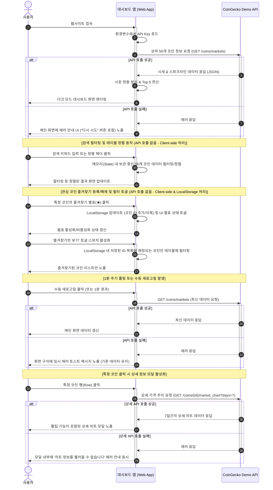

# [PRD] 암호화폐 실시간 시세 대시보드 웹서비스

본 문서는 **암호화폐 실시간 시세 및 시장 분석 대시보드**의 요구사항 정의서(PRD)입니다. 개발자와 디자이너, 마케터 등 프로젝트에 참여하는 모든 팀원이 서비스의 목적을 이해하고 일관된 방향으로 개발할 수 있도록 돕기 위해 작성되었습니다.

---

## 1. 프로젝트 개요

### 1.1. 서비스 목적 및 배경
* **배경**: 암호화폐 시장은 24시간 끊임없이 변동하며, 투자자들은 신속하고 정확한 시장 흐름 파악을 필요로 합니다. 여러 거래소에 분산된 정보를 한눈에 직관적으로 비교하고 분석하기 어렵다는 문제점이 있습니다.
* **목적**: CoinGecko API를 연동하여 신뢰할 수 있는 글로벌 시세와 등락률 정보를 직관적인 대시보드 형태로 제공합니다. 투자자들이 복잡한 가입 없이도 시장 현황을 쉽고 빠르게 진단할 수 있도록 돕습니다.

### 1.2. 타겟 사용자 (Target Audience)
* **초보 투자자**: 어려운 차트 도구 대신 직관적인 지표와 시장 요약을 원하는 사용자
* **일일 거래자(Day Trader)**: 실시간(1분 주기) 변동폭을 빠르게 체크하고 오늘의 급등락 코인을 파악하고 싶은 투자자
* **글로벌 시세 확인자**: 원화(KRW) 기준으로 주요 코인들의 글로벌 흐름 및 7일간의 가격 추이를 한눈에 보고 싶은 사용자
* **개인화 모니터링 사용자**: 수많은 암호화폐 중 본인이 관심 있는 특정 코인들만 즐겨찾기(★)하여 빠르게 시세를 추적하고 싶은 사용자

---

## 2. 핵심 요구사항 및 정책

### 2.1. 데이터 및 주기 정책
* **시세 데이터**: **CoinGecko Demo API**를 사용하여 시가총액 기준 상위 50개 암호화폐 데이터를 연동하여 표시합니다.
* **갱신 주기**: API 호출 제한(Rate Limit)을 고려하여 **1분에 한 번 자동으로 데이터를 새로고침(Polling)**하며, 사용자가 원할 때 즉시 데이터를 갱신할 수 있는 **'수동 새로고침 버튼'**을 UI 상에 제공합니다.
* **표시 통화**: 한국 표준 통화인 **KRW(원화)**를 기준으로 가격을 표시합니다.

### 2.2. 디자인 시스템 및 UI/UX 정책
* **테마**: 가독성을 높이고 눈의 피로를 최소화하기 위해 **다크 모드(Dark Mode) 단일 테마**로 디자인을 구성합니다.
  * 깊은 네이비/차콜 배경색, 네온 계열의 상승(Red/Emerald) 및 하락(Blue/Rose) 포인트 컬러를 적용하여 미래지향적인 핀테크 감성을 전달합니다.
* **반응형 웹(Responsive Web)**: 데스크탑, 태블릿, 모바일 기기의 모든 스크린 크기에 최적화된 레이아웃을 제공합니다.
  * 모바일 기기에서는 테이블 정보 중 덜 핵심적인 열(예: 시가총액 등)을 자동으로 숨기거나 가로 스크롤을 제공하여 레이아웃이 깨지지 않도록 합니다.

### 2.3. 보안 및 개발 환경 정책
* **API Key 보안**: CoinGecko Demo API 키는 프론트엔드 소스코드에 절대 직접 작성(하드코딩)하지 않으며, **환경변수(`.env`)로 관리**합니다. 배포 환경에서도 설정 파일이나 시스템 환경변수를 통해 주입되도록 설계합니다.

### 2.4. API 호출 프로세스 및 데이터 흐름

서비스는 사용자의 접속 시점부터 주기적인 폴링(Polling) 및 개별 인터랙션에 이르기까지 다음과 같은 흐름으로 CoinGecko API를 호출하고 데이터를 화면에 렌더링합니다.

1. **초기 진입**: 사용자가 웹 대시보드에 접속하면 앱은 환경변수(`.env`)에 정의된 CoinGecko API Key를 참조합니다.
2. **시세 목록 요청**: 시가총액 상위 50개 코인 정보를 가져오기 위해 CoinGecko의 `/coins/markets` 엔드포인트에 요청을 보냅니다. 이때 1시간/24시간/7일 등락률 비율 및 스파크라인 데이터를 포함하도록 쿼리 파라미터를 세팅합니다.
3. **가공 및 출력**: 응답받은 50개 코인 데이터를 가공하여 시장 상승/하락 비율을 판별하고, 24시간 변동률 기준 Top 5 상승/하락 코인을 계산하여 화면에 표시합니다.
4. **주기적 갱신 (1분 폴링 / 수동)**: 1분이 경과하거나 새로고침 버튼 클릭 시 위 과정을 반복합니다.
5. **상세 정보 요청**: 사용자가 특정 코인을 클릭하면, 해당 코인의 상세 차트 데이터를 위해 `/coins/{id}/market_chart` API를 추가로 호출하여 7일간의 상세 시세 정보를 모달 창에 시각화합니다.

#### 시퀀스 다이어그램 (Sequence Diagram)

---

## 3. 상세 기능 요구사항 (Functional Requirements)

### 3.1. 메인 대시보드 화면

#### A. 시장 현황 요약 카드 (Market Summary)
* **시장 진단 기능**: 전체 등록된 코인 중 상승 코인과 하락 코인의 비율을 계산하여 현재 시장이 **상승장(Bullish)**인지 **하락장(Bearish)**인지 텍스트와 그래픽으로 시각화합니다.
* **오늘의 상승/하락 Top 5**: 
  * **24시간(1일) 등락률**을 기준으로 가장 많이 오른 코인 5개와 가장 많이 떨어진 코인 5개를 실시간 순위 리스트 형태로 제공합니다.

#### B. 실시간 암호화폐 시세 테이블 (Crypto Table)
* **표시 대상**: 시가총액 기준 상위 50개 코인의 목록을 기본으로 제공합니다.
* **표시 정보 (Columns)**:
  1. **즐겨찾기 상태**: 활성화/비활성화 상태의 별표(★/☆) 아이콘
  2. **순위**: 시가총액 기준 순위
  3. **코인**: 코인 로고 이미지, 코인명, 심볼(티커, 예: BTC, ETH)
  4. **현재 가격(KRW)**: 천 단위 콤마(`,`) 및 원화 기호(`₩` 또는 `원`) 표기
  5. **등락률**: 1시간, 24시간(1일), 7일 등락률을 각각 백분율(`%`)로 표시 (상승은 빨간색/초록색 계열, 하락은 파란색 계열로 구분 표시)
  6. **시가총액(KRW)**: 한국어로 쉽게 읽을 수 있도록 억/조 단위 표기를 권장 (예: 120조 5,000억 원)
  7. **7일 가격 추이**: 7일간의 가격 흐름을 보여주는 심플한 선 차트(스파크라인, Sparkline) 표시
* **테이블 기능 (Client-side 처리)**:
  * **검색**: 코인명 또는 심볼로 실시간 검색이 가능해야 하며, 입력 즉시 클라이언트 단(메모리 데이터)에서 목록을 필터링하여 API 재호출이 발생하지 않도록 합니다.
  * **정렬**: 가격순 및 등락률순(1시간/24시간/7일 기준 상승률 높은순/낮은순)으로 목록을 정렬할 수 있는 기능을 제공하며, 이미 수신 완료된 데이터셋 내에서 클라이언트 사이드로 정렬을 수행합니다.

#### C. 관심 코인 즐겨찾기 (Watchlist) 기능
* **로컬 북마크**: 각 코인의 행 왼쪽에 별표(☆) 버튼을 제공하여, 클릭 시 채워진 별표(★) 상태로 변경되고 해당 코인의 고유 ID를 브라우저의 **LocalStorage**에 배열 형태로 즉시 추가합니다. 이미 등록된 별표(★)를 다시 누르면 LocalStorage에서 제거됩니다.
* **즐겨찾기 필터**: 시세 테이블 상단에 **'즐겨찾기 목록만 보기' 토글 스위치**를 제공합니다.
  * 스위치가 ON으로 활성화되면, 현재 전체 50개 코인 중 LocalStorage에 등록된 코인들만 테이블에 즉시 필터링하여 노출합니다.
  * 검색 및 정렬 기능은 즐겨찾기 필터가 적용된 상태 내에서도 독립적으로 작동(Client-side)해야 합니다.
  * 즐겨찾기 목록이 비어 있는 상태에서 토글 ON을 할 경우, 테이블 영역에 '즐겨찾기한 코인이 없습니다. 관심 있는 코인의 별표를 눌러 등록해 보세요.'라는 가이드 메시지를 노출합니다.

#### D. 에러 핸들링 및 안내 (Error Handling)
* **메인 대시보드 API 호출 실패 시**:
  * 네트워크 장애나 API Key 설정 오류, 또는 CoinGecko API의 일시적 속도 제한(Rate Limit, HTTP 429 에러 등)으로 시세 조회가 불가능한 경우, 메인 테이블 영역을 대체하는 **에러 전용 UI**를 노출합니다.
  * 에러 UI에는 **"데이터를 불러오는 데 실패했습니다. 잠시 후 다시 시도해 주세요."**라는 직관적인 안내 문구와 함께, 클릭 시 API 조회를 수동으로 즉시 재시도할 수 있는 **'다시 시도(Retry)' 버튼**을 배치합니다.
* **상세 차트 API 호출 실패 시**:
  * 특정 코인 클릭 시 상세 정보를 요청하는 API가 실패하는 경우, 모달 창이 그냥 닫히거나 빈 페이지만 남지 않도록 차트 영역에 **"상세 차트 데이터를 불러올 수 없습니다."**라는 문구와 **'다시 시도' 버튼**을 모달 내부에 배치하여 사용자 경험의 영속성을 제공합니다.

---

### 3.2. 코인 상세 정보 뷰 (Detailed Modal/View)

* **진입 경로**: 메인 테이블에서 특정 코인의 행(Row)을 클릭하면 **화면 내 모달(Modal)** 창이 활성화됩니다.
* **제공 정보**:
  * 해당 코인의 기본 정보 (로고, 이름, 순위, 현재가, 24시간 고가/저가, 거래량 등)
  * **상세 7일 가격 추이 차트**: 단순 스파크라인이 아닌, 시간별 가격 축(X축)과 금액 축(Y축)이 선명하게 나타나는 정교한 라인 차트를 제공하여 사용자가 마우스를 올렸을 때(Hover) 해당 시점의 가격을 툴팁으로 확인할 수 있도록 구현합니다.
  * 상세 정보 닫기 버튼을 통해 손쉽게 메인 화면으로 돌아갈 수 있어야 합니다.

---

## 4. 비기능적 요구사항 (Non-Functional Requirements)

### 4.1. 성능 및 최적화
* **API 호출 최적화**: 1분 주기 폴링 시 필요한 엔드포인트만 호출하여 불필요한 네트워크 트래픽 및 API 호출 할당량 낭비를 예방합니다.
* **렌더링 성능**: 코인 목록이 많아질 경우 화면 버벅임이 없도록 테이블 렌더링을 최적화하고, 이미지(코인 로고 등)에 Lazy Loading 또는 캐싱을 적용합니다.

### 4.2. 접근성 및 편의성
* **모바일 최적화 (Mobile-First UX)**: 모바일 디바이스에서 테이블 행을 터치하기 쉽게 영역을 충분히 확보하고, 모달 창이 모바일 화면 크기에 맞춰 아래에서 위로 슬라이드되는 형태(Bottom Sheet) 등으로 최적화합니다.

---

## 5. 단계별 개발 로드맵 (Roadmap)

### Phase 1: MVP 개발 (기본 기능 구현)
* 환경변수 파일(`.env`) 설정 및 CoinGecko Demo API 연동
* 다크 모드 기반의 CSS 디자인 시스템 구축
* 메인 화면 시세 테이블 구현 (1시간/24시간/7일 등락률, 시가총액, 검색 및 정렬 기능 포함)
* **관심 코인 즐겨찾기(Watchlist) 기능 및 LocalStorage 연동** 구현
* 1분 자동 폴링 및 새로고침 버튼 구현

### Phase 2: 상세 정보 및 시장 분석 강화
* 특정 코인 클릭 시 상세 정보 및 상세 차트(X/Y축 툴팁 포함)를 보여주는 모달 창 구현
* 시장 현황 요약 카드 구현 (상승장/하락장 판별기 및 오늘의 Top 5 상승/하락 코인)
* 모바일/태블릿 반응형 UI 디테일 개선

### Phase 3 (추후 검토): 개인화 확장 및 다환경 대응 (Backlog)
* 다국어(영어/한국어) 지원 및 KRW / USD 통화 스위치 기능 추가

---

## 6. 오픈 질문 및 예외 처리 (Edge Cases)

* **API 연결 실패 시**: CoinGecko API 서버 점검 또는 트래픽 초과로 데이터를 가져오지 못하는 경우, 사용자에게 오류 메시지를 친절하게 보여주고 "재시도" 버튼을 노출합니다.
* **상세 차트 데이터 누락**: 신생 코인 등 7일간의 가격 데이터가 존재하지 않는 코인의 경우, 차트 영역에 '차트 데이터를 불러올 수 없습니다'라는 안내 문구를 노출합니다.
