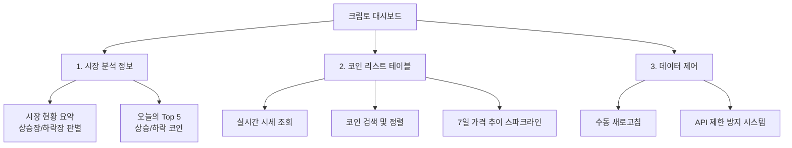

# 제품 요구사항 명세서 (PRD)
## 프로젝트명: 암호화폐 실시간 시세 대시보드 (Crypto Live Dashboard)

본 문서는 암호화폐 투자자를 위한 실시간 시세 조회 및 시장 분석용 웹 대시보드 서비스의 제품 요구사항 명세서(PRD)입니다. 초보 개발자 및 디자이너도 쉽게 이해하고 구현할 수 있도록 구체적인 시나리오와 용어 설명을 포함하여 작성되었습니다.

---

## 1. 프로젝트 개요 (Overview)

### 1.1 배경 및 목적
암호화폐 시장은 24시간 끊임없이 변동하며, 투자자들은 신속하고 정확한 시장 흐름 파악을 필요로 합니다. 본 프로젝트는 투자자들이 복잡한 정보 속에서 **핵심 시세 정보와 시장의 전반적인 분위기를 한눈에 직관적으로 파악**할 수 있는 웹 기반 대시보드를 제공하는 것을 목적으로 합니다.

### 1.2 타겟 사용자 (Target Audience)
*   **초보 암호화폐 투자자**: 복잡한 거래소 화면 대신, 심플하게 현재 시장의 상승/하락 흐름과 주요 코인의 시세를 파악하고 싶은 사용자.
*   **라이트 투자자**: 이동 중이거나 다른 업무를 보면서 모바일 및 PC 화면으로 틈틈이 시세 동향을 체크하고 싶은 사용자.

### 1.3 기대 효과
*   **시각적 즉시성**: 7일간의 가격 추이를 스파크라인(Sparkline)을 통해 직관적으로 인지.
*   **시장 분석 피로도 감소**: 전체 코인의 변동률을 계산해 시장이 현재 '상승장'인지 '하락장'인지 바로 확인 가능.
*   **편리한 검색 및 정렬**: 원하는 코인을 빠르게 찾고 가격이나 등락률 순으로 나열하여 시장 주도 코인 파악.

---

## 2. 주요 기능 정의 (Key Features)

서비스의 핵심 기능은 크게 세 가지 영역으로 나뉩니다.

### 2.1 시장 분석 정보 (Market Analytics)
*   **시장 현황 요약**: 현재 시장이 **상승장(Bull Market)**인지 **하락장(Bear Market)**인지 직관적인 텍스트와 디자인 요소(색상, 아이콘)로 표시합니다.
    *   *판별 기준*: 대시보드에 노출되는 전체 코인 중 **24시간 대비 가격이 상승한 코인의 비율이 50% 이상이면 '상승장'**, **50% 미만이면 '하락장'**으로 정의합니다.
*   **오늘의 Top 5 코인**: 24시간 변동률 기준 가장 많이 상승한 코인 5개(상승 Top 5)와 가장 많이 하락한 코인 5개(하락 Top 5)를 별도 카드로 요약 표시합니다.

### 2.2 코인 리스트 테이블 (Coin List & Search)
*   **실시간 시세 테이블**: 다음 항목들을 포함하는 데이터 테이블을 제공합니다.
    *   **코인 정보**: 로고 이미지, 코인 한글명/영문명, 심볼(예: BTC, ETH)
    *   **현재 가격**: 원화(KRW) 기준 가격 표시 (천 단위 쉼표 포맷팅 적용)
    *   **등락률**: 1시간, 24시간(1일), 7일 기준 변동률(%) 표시 (상승 시 빨간색/▲, 하락 시 파란색/▼ 등 시각적 구분)
    *   **시가총액**: 원화(KRW) 기준 시가총액 표시
    *   **7일 가격 추이 차트**: **스파크라인(Sparkline)** 형태의 단순 선 그래프를 테이블 내부에 삽입하여 7일간의 가격 흐름을 한눈에 시각화합니다.
*   **검색**: 코인명(한글/영문) 또는 심볼로 원하는 코인을 실시간 필터링하여 찾을 수 있습니다.
*   **정렬**: 가격(높은/낮은 순), 등락률(높은/낮은 순), 시가총액(높은/낮은 순) 기준으로 테이블 데이터를 정렬할 수 있습니다.

### 2.3 데이터 제어 및 API 정책 (Data Control)
*   **수동 새로고침**: 사용자가 언제든지 최신 정보를 불러올 수 있도록 화면 우상단 또는 대시보드 제어 영역에 '새로고침' 버튼을 배치합니다.
*   **API 호출 제한 방지**: CoinGecko Demo API의 호출 제한(Rate Limit)을 고려하여, **새로고침 요청 후 최소 10초 동안은 추가적인 API 호출을 차단**하는 디바운스(Debounce) 또는 쓰로틀(Throttle) 장치를 UI에 적용합니다. (버튼 비활성화 및 쿨타임 타이머 표시)

---

## 3. 화면 설계 및 UI/UX 요구사항 (UX & Layout)

### 3.1 공통 디자인 가이드라인
*   **디자인 톤앤매너**: 어두운 배경(Dark Theme)을 기본으로 하여 암호화폐 투자 서비스 특유의 전문적이고 세련된 느낌을 제공합니다. (글래스모피즘, 부드러운 그라데이션 적용)
*   **상태 색상**:
    *   **상승/긍정**: 초록색 계열(거래소 표준에 맞춘 빨간색 혹은 글로벌 스탠다드 초록색 중 선택 가능하며, 여기서는 직관적인 `Emerald Green` 또는 한국 거래소 스타일의 `Red` 계열 중 일관성 있게 차용. 대시보드 시인성을 위해 Neon Green 계열 추천)
    *   **하락/부정**: 파란색 계열(`Cool Blue` 또는 Neon Blue 계열)
*   **가독성**: 긴 시가총액이나 소수점 이하의 가격이 깨지지 않고 정렬되도록 숫자 정렬(오른쪽 정렬)을 준수합니다.

### 3.2 반응형 레이아웃 설계 (Responsive Layout)
본 서비스는 다양한 디바이스 화면 크기에 맞추어 레이아웃이 유연하게 레이아웃이 재배치되어야 합니다.

#### 1) 데스크톱 뷰 (Desktop, Width ≥ 1024px)
*   **Header**: 서비스 로고, 새로고침 버튼 (API 쿨타임 표시기 포함)
*   **Section 1 (시장 분석 - 가로 배치)**:
    *   [좌] 시장 현황 요약 카드 (상승장/하락장 여부, 상승 코인 비율 그래프)
    *   [우] 오늘의 Top 5 카드 (상승 5 / 하락 5 나란히 배치)
*   **Section 2 (테이블 제어)**: 코인 검색 바, 정렬 드롭다운
*   **Section 3 (시세 테이블)**: 모든 컬럼(로고, 코인명, 가격, 1h/24h/7d 변동률, 시가총액, 7일 스파크라인)을 정상적으로 한 화면에 출력.

#### 2) 태블릿/모바일 뷰 (Mobile/Tablet, Width < 1024px)
*   **Header**: 타이틀 및 심플한 새로고침 아이콘
*   **Section 1 (시장 분석 - 세로 스택)**: 시장 현황 카드와 Top 5 카드가 위아래로 쌓임. Top 5 카드는 좌우 슬라이드(Swiper) 혹은 탭(Tab) 형식으로 전환 가능하게 구성.
*   **Section 2 (테이블 제어)**: 검색창이 화면 너비를 꽉 채우도록 배치.
*   **Section 3 (시세 테이블 - 컬럼 축소)**:
    *   화면 너비 제약으로 인해 일부 컬럼 숨김 처리:
        *   **필수 노출**: 코인명(로고 포함), 현재 가격, 24시간 변동률, 7일 스파크라인
        *   **숨김 처리**: 1시간 변동률, 7일 변동률, 시가총액 (터치 시 아코디언 형태로 세부 정보 노출하는 디자인 권장)

---

## 4. 데이터 연동 규격 (API Specification)

본 서비스는 **CoinGecko Demo API**를 사용하여 실시간 및 과거 시세를 조회합니다.

### 4.1 호출 대상 API 엔드포인트
*   **코인 정보 및 시세 데이터 받아오기**
    *   `GET https://api.coingecko.com/api/v3/coins/markets`
    *   *필수 파라미터*:
        *   `vs_currency`: `krw` (원화 기준 가격 조회)
        *   `order`: `market_cap_desc` (시가총액 순 정렬)
        *   `per_page`: `100` (조회할 코인 개수, 초기 100개 기준 분석)
        *   `page`: `1`
        *   `sparkline`: `true` (7일간의 스파크라인 데이터를 포함하여 받아오기 위해 필수 지정)
        *   `price_change_percentage`: `1h,24h,7d` (1시간, 24시간, 7일 등락률을 응답에 포함)

### 4.2 주요 바인딩 데이터 구조
API에서 전달받은 응답 객체에서 다음 필드들을 추출하여 UI에 반영합니다.

| UI 표시 항목 | API 매핑 필드 | 데이터 처리 예시 |
| :--- | :--- | :--- |
| **코인 로고** | `image` | URL 이미지 로드 |
| **코인 이름** | `name` (영문) / ID 기준 매핑 | 영문 표시 혹은 주요 코인 한글 사전 변환 |
| **현재 가격** | `current_price` | `number.toLocaleString()`을 통해 `₩54,320,000` 형태로 변환 |
| **1시간 변동률** | `price_change_percentage_1h_in_currency` | 소수점 둘째 자리 반올림 (`+1.23%` / `-0.50%`) |
| **24시간 변동률** | `price_change_percentage_24h_in_currency` | 소수점 둘째 자리 반올림 |
| **7일 변동률** | `price_change_percentage_7d_in_currency` | 소수점 둘째 자리 반올림 |
| **시가총액** | `market_cap` | 억/조 단위 간소화 포맷 적용 또는 전체 금액 표시 |
| **스파크라인 데이터**| `sparkline_in_7d.price` | 약 168개(24시간 x 7일)의 가격 숫자 배열. SVG 선(Path)으로 시각화. |

---

## 5. 상세 기능 및 예외 처리 (Edge Cases & Exception Handling)

### 5.1 API 호출 제한 (Rate Limit) 에러 대응
*   **현상**: CoinGecko Free/Demo API는 단시간 내 호출이 과도할 경우 `HTTP 429 Too Many Requests` 에러를 반환합니다.
*   **대응**:
    *   API 에러 발생 시 사용자에게 **"일시적으로 호출 한도를 초과했습니다. 잠시 후 새로고침해 주세요."**라는 토스트 알림 또는 에러 배너를 노출합니다.
    *   기존에 성공적으로 불러왔던 데이터를 유지하여 화면이 공백으로 변하지 않도록 처리합니다 (Local Storage 또는 메모리 캐싱 데이터 보존).

### 5.2 스파크라인 가격 변동 범위 오류 방지
*   **현상**: 7일간 가격 변동이 매우 적은 코인의 경우 스파크라인 그래프가 지나치게 평평하거나, 가격 격차가 큰 경우 그래프가 화면을 벗어날 수 있습니다.
*   **대응**: SVG 차트를 그릴 때 스파크라인 데이터 내 `최솟값`과 `최대값`을 기준으로 Y축 스케일을 유연하게 동적 계산(Min-Max Scaling)하여 그래프가 영역 내에 항상 채워지도록 구현합니다.

### 5.3 검색 결과 없음 처리
*   사용자가 존재하지 않는 코인명이나 심볼을 입력한 경우, 테이블 영역에 **"검색 결과와 일치하는 코인이 없습니다."**라는 문구를 일러스트 또는 아이콘과 함께 표시하여 피드백을 제공합니다.

---

## 6. 용어 설명 (Glossary for Beginners)

*   **대시보드 (Dashboard)**: 다양한 소스에서 수집한 핵심 지표와 데이터를 모아 한눈에 볼 수 있도록 구성한 시각적 화면입니다.
*   **스파크라인 (Sparkline)**: 텍스트나 표 중간에 삽입되는 매우 작고 단순한 선 그래프로, 축이나 격자 없이 데이터의 흐름과 추세만 직관적으로 나타내기에 적합합니다.
*   **API (Application Programming Interface)**: 특정 서비스나 서버의 데이터를 다른 프로그램이 요청하여 받아 쓸 수 있도록 만든 인터페이스입니다. 본 서비스는 CoinGecko의 암호화폐 데이터베이스를 API를 통해 받아옵니다.
*   **디바운스/쓰로틀 (Debounce/Throttle)**: 짧은 시간 안에 동일한 요청이나 이벤트가 반복해서 많이 실행되지 않도록 강제로 대기 시간(쿨타임)을 두거나 제어하는 최적화 기법입니다.
